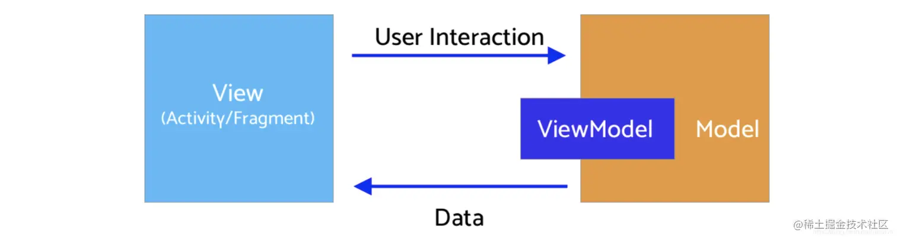
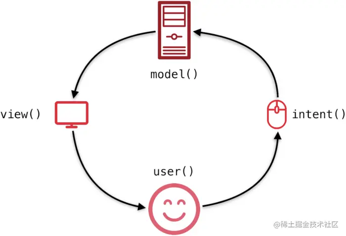
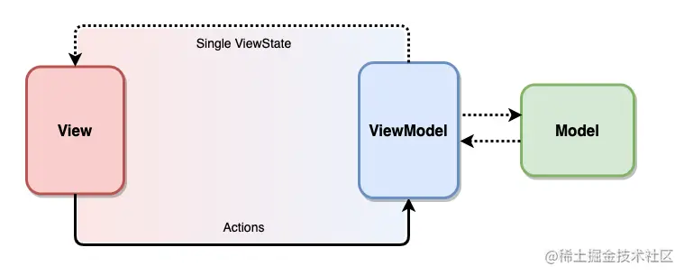

# MVI

Android架构演变从MVC到MVP，再到MVVM，Google又推出了MVI，为何要推出MVI，MVVM有那些不足，MVI又有那些有点

## MVVM

Model — View — ViewModel (MVVM)，这个是MVVM的全称：
View：对应的UI层，Activity、Fragment等界面层
Model：数据层，和ViewModel一起负责数据的获取和操作
ViewModel：数据View和Model的中间层，隔离View和Model

MVVM的特点是ViewMode和View数据的双向绑定，通过DataBindig和LiveData进行数据的通信，UI层发生改变时会自动调用ViewModel的接口，
出发数据的操作和获取，数据获取之后ViewModel层通过liveData通知UI层更新界面。这里是双向绑定。

在实际的使用中，DataBing用的比较少，大多是UI蹭主动调用ViewModel层的api，通知ViewModel去操作或者获取数据。


### MVVM 实例

简单的登录页面，输入Email和password，ViewModel通知View层展示Toast提示，同时ViewModel不会持有View对象。

#### 第一步：DataBinding
在build.gradle中配置databinding开关：
```
android {

   dataBinding {

       enabled = true

      }

}
```
同时添加对库的引用：implementation ‘android.arch.lifecycle:extensions:1.1.1’


#### 第二步：xml

```
<resources>
	<string name="app_name">GfG | MVVM Architecture</string>
	<string name="heading">MVVM Architecture Pattern</string>
	<string name="email_hint">Enter your Email ID</string>
	<string name="password_hint">Enter your password</string>
	<string name="button_text">Login</string>
</resources>

```

##### 第三步：创建Model类
Model是一个数据类，包含了Email和password数据，不会包含其他逻辑
```
import androidx.annotation.Nullable;

public class Model {

	@Nullable
	String email,password;

	// constructor to initialize
	// the variables
	public Model(String email, String password){
		this.email = email;
		this.password = password;
	}

	// getter and setter methods
	// for email variable
	@Nullable
	public String getEmail() {
		return email;
	}

	public void setEmail(@Nullable String email) {
		this.email = email;
	}

	// getter and setter methods
	// for password variable
	@Nullable
	public String getPassword() {
		return password;
	}

	public void setPassword(@Nullable String password) {
		this.password = password;
	}

}

```

Model只是一个数据集合类，不包含对数据的操作，职能比较单一


#### 第四步：activity_main.xml
```
<?xml version="1.0" encoding="utf-8"?>
<layout xmlns:android="http://schemas.android.com/apk/res/android"
	xmlns:app="http://schemas.android.com/apk/res-auto"
	xmlns:bind="http://schemas.android.com/tools">

	<!-- binding object of ViewModel to the XML layout -->
	<data>
		<variable
			name="viewModel"
			type="com.example.mvvmarchitecture.AppViewModel" />
	</data>

	<!-- Provided Linear layout for the activity components -->
	<LinearLayout
		android:layout_width="match_parent"
		android:layout_height="match_parent"
		android:layout_gravity="center"
		android:layout_margin="8dp"
		android:background="#168BC34A"
		android:orientation="vertical">

		<!-- TextView for the heading of the activity -->
		<TextView
			android:id="@+id/textView"
			android:layout_width="match_parent"
			android:layout_height="wrap_content"
			android:text="@string/heading"
			android:textAlignment="center"
			android:textColor="@android:color/holo_green_dark"
			android:textSize="36sp"
			android:textStyle="bold" />

		<!-- EditText field for the Email -->
		<EditText
			android:id="@+id/inEmail"
			android:layout_width="match_parent"
			android:layout_height="wrap_content"
			android:layout_marginStart="10dp"
			android:layout_marginTop="60dp"
			android:layout_marginEnd="10dp"
			android:layout_marginBottom="20dp"
			android:hint="@string/email_hint"
			android:inputType="textEmailAddress"
			android:padding="8dp"
			android:text="@={viewModel.userEmail}" />

		<!-- EditText field for the password -->
		<EditText
			android:id="@+id/inPassword"
			android:layout_width="match_parent"
			android:layout_height="wrap_content"
			android:layout_marginStart="10dp"
			android:layout_marginEnd="10dp"
			android:hint="@string/password_hint"
			android:inputType="textPassword"
			android:padding="8dp"
			android:text="@={viewModel.userPassword}" />

		<!-- Login Button of the activity -->
		<Button
			android:layout_width="match_parent"
			android:layout_height="wrap_content"
			android:layout_marginStart="20dp"
			android:layout_marginTop="60dp"
			android:layout_marginEnd="20dp"
			android:background="#4CAF50"
			android:fontFamily="@font/roboto"
			android:onClick="@{()-> viewModel.onButtonClicked()}"
			android:text="@string/button_text"
			android:textColor="@android:color/background_light"
			android:textSize="30sp"
			android:textStyle="bold"
			bind:toastMessage="@{viewModel.toastMessage}" />

		<ImageView
			android:id="@+id/imageView"
			android:layout_width="match_parent"
			android:layout_height="wrap_content"
			android:layout_marginTop="135dp"
			app:srcCompat="@drawable/banner" />

	</LinearLayout>
</layout>

```
这里涉及到了DataBinding，Button点击后会调用viewModel.onButtonClicked()，同时如果EditText的数据会从viewModel.userPassword获取。这里的ViewModel数据变化时，如何同步更新到UI层：通过notifyPropertyChanged、notifyChange刷新


#### 第五步：创建ViewModel类
这个类包含了View层调用的api和数据层的获取
```
import android.text.TextUtils;
import android.util.Patterns;
import androidx.databinding.BaseObservable;
import androidx.databinding.Bindable;

public class AppViewModel extends BaseObservable {

	// creating object of Model class
	private Model model;  

	// string variables for
	// toast messages
	private String successMessage = "Login successful";
	private String errorMessage = "Email or Password is not valid";

	@Bindable
	// string variable for
	// toast message
	private String toastMessage = null;

	// getter and setter methods
	// for toast message
	public String getToastMessage() {
		return toastMessage;
	}

	private void setToastMessage(String toastMessage) {
		this.toastMessage = toastMessage;
		notifyPropertyChanged(BR.toastMessage);
	}

	// getter and setter methods
	// for email variable
	@Bindable
	public String getUserEmail() {
		return model.getEmail();
	}

	public void setUserEmail(String email) {
		model.setEmail(email);
		notifyPropertyChanged(BR.userEmail);
	}

	// getter and setter methods
	// for password variable
	@Bindable
	public String getUserPassword() {
		return model.getPassword();
	}

	public void setUserPassword(String password) {
		model.setPassword(password);
		notifyPropertyChanged(BR.userPassword);
	}

	// constructor of ViewModel class
	public AppViewModel() {

		// instantiating object of
		// model class
		model = new Model("","");
	}

	// actions to be performed
	// when user clicks
	// the LOGIN button
	public void onButtonClicked() {
		if (isValid())
			setToastMessage(successMessage);
		else
			setToastMessage(errorMessage);
	}

	// method to keep a check
	// that variable fields must
	// not be kept empty by user
	public boolean isValid() {
		return !TextUtils.isEmpty(getUserEmail()) && Patterns.EMAIL_ADDRESS.matcher(getUserEmail()).matches()
				&& getUserPassword().length() > 5;
	}
}

```

第六步：创建View层

View层持有ViewModel对象，DataBinding将会触发Toast
```
import android.os.Bundle;
import android.view.View;
import android.widget.Toast;
import androidx.appcompat.app.AppCompatActivity;
import androidx.databinding.BindingAdapter;
import androidx.databinding.DataBindingUtil;
import com.example.mvvmarchitecture.databinding.ActivityMainBinding;

public class MainActivity extends AppCompatActivity {

	@Override
	protected void onCreate(Bundle savedInstanceState)
	{
		super.onCreate(savedInstanceState);

		// ViewModel updates the Model
		// after observing changes in the View

		// model will also update the view
		// via the ViewModel
		ActivityMainBinding activityMainBinding
			= DataBindingUtil.setContentView(
				this, R.layout.activity_main);
		activityMainBinding.setViewModel(
			new AppViewModel());
		activityMainBinding.executePendingBindings();
	}
}

// any change in toastMessage attribute
// defined on the Button with bind prefix
// invokes this method
@BindingAdapter({ "toastMessage" })
public static void runMe(View view, String message)
{
if (message != null)
	Toast
	.makeText(view.getContext(), message,
			Toast.LENGTH_SHORT)
	.show();
}

```

MVVM存在一些弊端：
1. 数据的双向绑定，DataBinding在实际中很少使用
2. ViewModel到View层通过LiveData通知，将会有很多个全局变量，每个LiveData需要写两遍，一个可变的，一个不可变的，比较复杂
3. View层与ViewModel的交互比较分散，没有统一管理


那么MVI会不会解决以上的痛点，MVI又有什么痛点


## MVI

MVI与MVVM比较类似，借鉴了前端架构的思想，更加强调的是数据的单向流动和唯一数据源的原则。



1. Model:与MVVM中的Model不同，MVI的model主要指UI状态（state），不在是抽象的数据集合。例如页面加载状态，控件的位置等
2. View：与MVVM中的view一致
3. Intent：用户的任何的操作都会被包装成Intent发送给ViewModel进行数据的请求

单向流数据：
MVI强调数据的单向流动：
1. 用户操作以Intent通知ViewModel
2. ViewModel基于Intent更新UI的state
3. View层接受到State变化后更新UI

数据永远在一个环形结构中单向流动，不能反向流动




总体架构图：


1. Model层承载UI状态，并暴露出ViewState供View订阅，ViewState是个data class,包含所有页面状态
2. View层通过Action更新ViewState，替代MVVM通过调用ViewModel方法交互的方式


### 实例
还是用登录页面作为实例

#### Model层
Model层承载了页面状态和数据

[LoginViewState.kt]
```
data class LoginViewState(val userName: String = "", val password: String = "") {
    val isLoginEnable: Boolean
        get() = userName.isNotEmpty() && password.length >= 6
    val passwordTipVisible: Boolean
        get() = password.length in 1..5
}

sealed class LoginViewEvent {
    data class ShowToast(val message: String) : LoginViewEvent()
    object ShowLoadingDialog : LoginViewEvent()
    object DismissLoadingDialog : LoginViewEvent()
}

sealed class LoginViewAction {
    data class UpdateUserName(val userName: String) : LoginViewAction()
    data class UpdatePassword(val password: String) : LoginViewAction()
    object Login : LoginViewAction()
}
```

这里LoginViewState包含了userName和password，同时包含了View层到ViewModel的LoginViewAction，以及ViewModel到View层的Event：LoginViewEvent

这个Model的定义和MVVM有很大的差距，如果是MVVM的Model，只会包含userName和Password，不会把Action和Event包含进来。


#### ViewModel层


```
class LoginViewModel : ViewModel() {
    private val _viewStates = MutableLiveData(LoginViewState())
    val viewStates = _viewStates.asLiveData()
    private val _viewEvents =  MutableLiveData(LoginViewEvent()）
    val viewEvents = _viewEvents.asLiveData()

    fun dispatch(viewAction: LoginViewAction) {
        when (viewAction) {
            is LoginViewAction.UpdateUserName -> updateUserName(viewAction.userName)
            is LoginViewAction.UpdatePassword -> updatePassword(viewAction.password)
            is LoginViewAction.Login -> login()
        }
    }

    private fun updateUserName(userName: String) {
        _viewStates.setState { copy(userName = userName) }
    }

    private fun updatePassword(password: String) {
        _viewStates.setState { copy(password = password) }
    }

    private fun login() {
        viewModelScope.launch {
            flow {
                loginLogic()
                emit("登录成功")
            }.onStart {
                _viewEvents.setEvent(LoginViewEvent.ShowLoadingDialog)
            }.onEach {
                _viewEvents.setEvent(
                    LoginViewEvent.DismissLoadingDialog, LoginViewEvent.ShowToast(it)
                )
            }.catch {
                _viewStates.setState { copy(password = "") }
                _viewEvents.setEvent(
                    LoginViewEvent.DismissLoadingDialog, LoginViewEvent.ShowToast("登录失败")
                )
            }.collect()
        }
    }

    private suspend fun loginLogic() {
        withState(viewStates) {
            val userName = it.userName
            val password = it.password
            delay(2000)
            throw Exception("登录失败")
            "$userName,$password"
        }
    }
}
```

1. ViewModel层，只需要定义viewStates和viewEvents，不需要在增加其他的定义，后续在增加状态时在Model中增加
2. ViewEvents通过LiveData通知，当然也可以使用Channel实现
3. 当更新状态时使用Flow


#### View层

```
class FlowLoginActivity : AppCompatActivity() {
    private val viewModel by viewModels<LoginViewModel>()
    override fun onCreate(savedInstanceState: Bundle?) {
        super.onCreate(savedInstanceState)
        setContentView(R.layout.layout_login)
        initView()
        initViewStates()
        initViewEvents()
    }

    private fun initView() {
        edit_user_name.addTextChangedListener {
            viewModel.dispatch(LoginViewAction.UpdateUserName(it.toString()))
        }
        edit_password.addTextChangedListener {
            viewModel.dispatch(LoginViewAction.UpdatePassword(it.toString()))
        }
        btn_login.setOnClickListener {
            viewModel.dispatch(LoginViewAction.Login)
        }
    }

    private fun initViewStates() {
        viewModel.viewStates.let { states ->
            states.observeState(this, LoginViewState::userName) {
                edit_user_name.setText(it)
                edit_user_name.setSelection(it.length)
            }
            states.observeState(this, LoginViewState::password) {
                edit_password.setText(it)
                edit_password.setSelection(it.length)
            }
            states.observeState(this, LoginViewState::isLoginEnable) {
                btn_login.isEnabled = it
                btn_login.alpha = if (it) 1f else 0.5f
            }
            states.observeState(this, LoginViewState::passwordTipVisible) {
                tv_label.visibility = if (it) View.VISIBLE else View.INVISIBLE
            }
        }
    }

    private fun initViewEvents() {
        viewModel.viewEvents.observeEvent(this) {
            when (it) {
                is LoginViewEvent.ShowToast -> toast(it.message)
                is LoginViewEvent.ShowLoadingDialog -> showLoadingDialog()
                is LoginViewEvent.DismissLoadingDialog -> dismissLoadingDialog()
            }
        }
    }

    private var progressDialog: ProgressDialog? = null

    private fun showLoadingDialog() {
        if (progressDialog == null)
            progressDialog = ProgressDialog(this)
        progressDialog?.show()
    }

    private fun dismissLoadingDialog() {
        progressDialog?.takeIf { it.isShowing }?.dismiss()
    }
}
```

1. View层通过Intent的Action：viewModel.dispatch(LoginViewAction.UpdateUserName(it.toString()))通知ViewModel
2. ViewModel收到通知后，通过Intent通知_viewStates.setState { copy(userName = userName) }View层更新界面
3. View层收到通知后，在去刷新UI层

数据流是单向流，从View层到ViewModel，在到View层，这种单向数据流职责比较清晰，同时所有调用以 Action 的形式汇总到一处，也有利于对行为的集中分析和监控。


