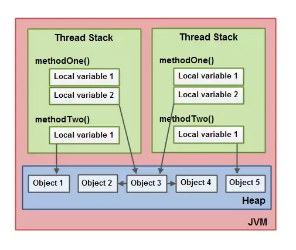
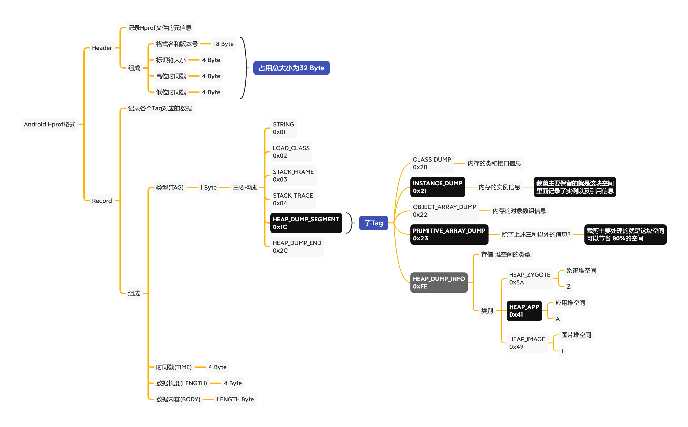
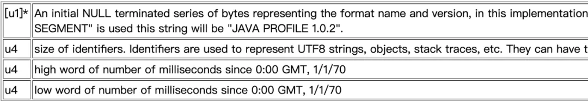
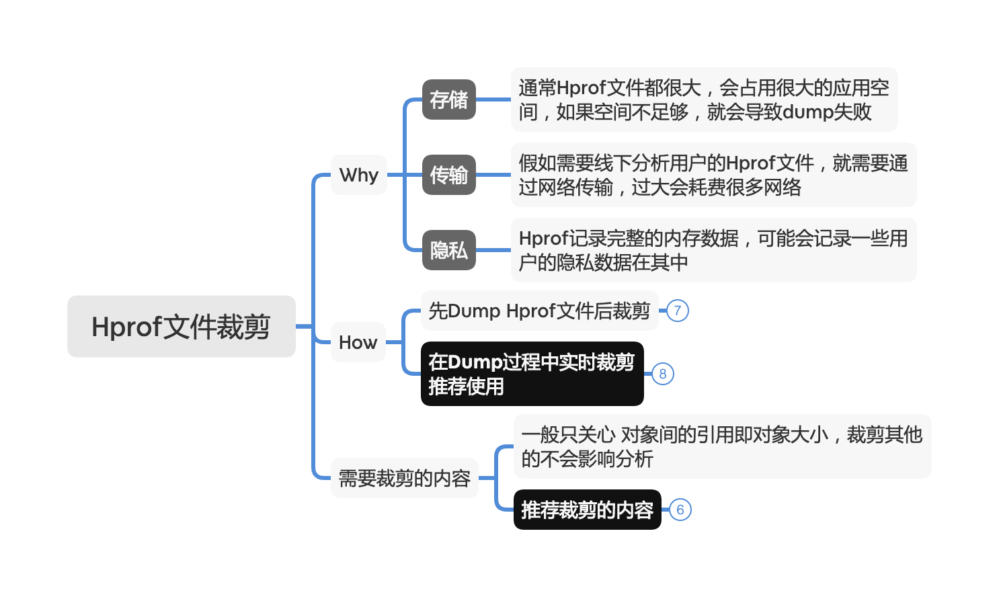
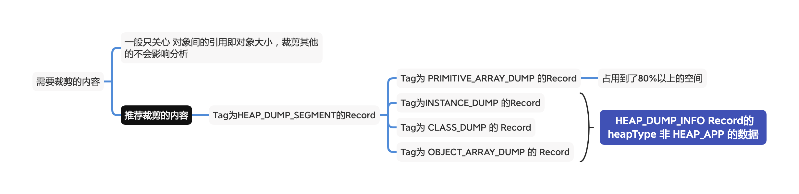

#内存泄露监控

### 内存泄露原理
Android为何会有内存泄露，通俗来说是对象申请的内存，GC后无法释放，对象被引用，但是是一个无用的对象，导致了内存的泄露。

java内存模型：



GC Roots对象：

1. 虚拟机栈(栈帧中的本地变量表)中引用的对象；
2. 方法区中类静态属性引用的对象
3. 方法区中常量引用的对象
4. 本地方法栈中JNI引用的对象


在heap中创建的object对象，被GC Roots引用，在GC回收时被认为是不可回收的对象，从而导致这个对象占用的内存是无法释放的，导致了内存的泄露。


### 内存泄露检测

内存检测利用对象的弱引用关系，通过出发gc检测弱引用是否存在，来实现检测内存是否泄露。


可以检测的对象有：
Activity对象
Fragment对象
View实例对象
ViewModel对象
Service实例

#### Activity对象的检测
通过ActivityLifecycleCallbacks进行activity的生命周期检测，在activity的onActivityDestroyed时，去检测当前activity是否泄露，但是如何检测是否泄露。
是通过多次出发gc以及定时去检测弱引用的对象是否被回收，这里的检测次数和时间是个关键点，需要怎么设置，LeakCanary是设置了GC后5s去检测，但是在QAPM方案中，
最大检测次数是100，时间间隔是5000ms。

Activity生命周期监控：

```
    public static boolean startActivityInspect() {
        if (Build.VERSION.SDK_INT >= Build.VERSION_CODES.ICE_CREAM_SANDWICH) {
            LifecycleCallback.INSTANCE.register(new IForeBackInterface() {
                @Override
                public void onForeground(@NonNull Activity activity) {
                }

                @Override
                public void onBackground(@NonNull Activity activity) {
                }

                @Override
                public void onCreate(@NonNull Activity activity) {
                }

                @Override
                public void onResume(@NonNull Activity activity) {
                }

                @Override
                public void onStop(@NonNull Activity activity) {
                }

                @Override
                public void onDestroy(@NonNull Activity activity) {
                    afterOnDestroy(activity);
                }
            });
            return true;
        } else {
            return replaceInstrumentation();
        }
    }
```

Activity的onDestroy回调中通过GC进行检测是否有泄露：

```
    private class InspectorRunner implements Runnable {
        private int retryCount = 0;
        private InspectUUID uuid;

        InspectorRunner(InspectUUID uuid, int retryCount) {
            this.retryCount = retryCount;
            this.uuid = uuid;
        }

        @Override
        public void run() {
            if (uuid == null) {
                Logger.INSTANCE.w(TAG, "uuid is null");
                return;
            }
            String digest = uuid.toString();
            try {
                Logger.INSTANCE.d(TAG, "Inspecting ", digest,
                        " Time=", String.valueOf(System.currentTimeMillis()),
                        " count=", String.valueOf(retryCount));
                //还没有释放
                if (uuid.weakObj.get() != null) {
                    if (++retryCount < loopMaxCount) {
                        doGc();
                        inspectorListener.onCheckingLeaked((retryCount - 1) * checkInterval / TIME_UNIT, digest);
                        leakHandler.postDelayed(this, checkInterval);
                        return;
                    }

                    //到这里是检查完毕了，回调一下通知结果
                    if (!inspectorListener.onLeaked(uuid)) {
                        // 手Q定制的变量，因为他们要自己dump使用
                        if (!keepUuidWhenLeaked) {
                            sPool.recycle(uuid);
                        }
                        return;
                    }

                    DumpResult result = dumpMemory(digest, autoDump, inspectorListener);
                    if (result.success) {
                        report(uuid.className, result.zipFilePath);
                    }
                } else {µ
                    Logger.INSTANCE.d(TAG, "inspect ", digest, " finished no leak");
                    sPool.recycle(uuid);
                }
            } catch (Throwable t) {
                Logger.INSTANCE.e(TAG, "error, ", digest,
                        " Time=", String.valueOf(System.currentTimeMillis()),
                        " count=", String.valueOf(retryCount),
                        " Throwable: ", Logger.INSTANCE.getThrowableMessage(t));
                sPool.recycle(uuid);
            }
        }
    }
```

### 内存泄露dump
通过对对象的监控，判断对象疑似泄露，就需要把内存dump出来，供分析找出原因。
通过子进程dump内存，使用系统提供的能力：Debug.dumpHprofData(path);

```
        boolean dumpRes = false;
        try {
            int pid = trySuspendVmThenFork();
            if (pid == 0) {
                // 子进程
                if (useCrop) {
                    initStripDump();
                    hprofName(path);
                }
                Debug.dumpHprofData(path);
                if (useCrop) {
                    boolean isSuccess = isStripSuccess();
                    Logger.INSTANCE.i(TAG, "notifyDumped:" + isSuccess);
                }
                //System.exit(0);
                exitProcess();
            } else {
                // 主进程
                resumeVM();
                dumpRes = waitDumping(pid);
                Logger.INSTANCE.i(TAG, "hprof pid:" + pid + " dumped: ", path, " dump result: ", String.valueOf(dumpRes));
            }

        } catch (IOException e) {
            Logger.INSTANCE.exception(TAG, "dump failed caused by IOException!", e);
        }
        return dumpRes
```

### 内存裁剪
内存裁剪分为两派：
1. dump之后，针对文件进行读取并裁剪：比如Shark、微信的Matrix
2. dump时直接对数据进行实时裁剪，需要hook数据的写入过程；比如美团的Probe、快手的KOOM

下面是原始的HPROF经过各种裁剪方案，最后压缩后的文件大小。


|原始大小|裁剪后| zip后|备注|
| ----|------- | -----|------ |
|Shark|154MB|154MB|6M| 
|Matrix|  154MB|   26M | 7M | 
|KOOM |   154MB|   17M |3M|

可以看到，HPROF文件的裁剪、压缩过程在上报之前还是非常有必要的。


**Hprof文件格式：**

整体分为Header和Record数组两部分。

#### Header
记录hprof的元信息：

格式名和版本号：JAVA PROFILE 1.0.2 (18byte)
标识符大小：4byte
高位时间戳：4byte
地位时间戳：4byte
Header总共占了18 + 4 + 4 + 4 = 32byte


#### Record数组
记录各个类型的数据

类型(TAG)：表示Record对应的类型(1Byte)
时间戳(TIME)：发生时间(4byte)
长度(LENGTH)：记录数据的长度(4byte)
记录数据(BODY)：记录的数据(${LENGTH}Byte)
单条Record总共占了1 + 4 + 4 + LENGTH byte


#### 支持的TAG类型
**一级Tag**
STRING_IN_UTF8 = 0x01
LOAD_CLASS = 0x02
STACK_FRAME = 0x04
STACK_TRACE = 0x05
HEAP_DUMP_SEGMENT = 0x1c
HEAP_DUMP_END = 0x2c
二级Tag
主要位于HEAP_DUMP_SEGMENT中

**Java所有的二级Tag**
HEAP_DUMP_INFO = 0xfe：存储的是堆空间的类型，主要有以下三种
HEAP_ZYGOTE = 0x5A Z 系统堆空间
HEAP_APP = 0x41 A 应用堆空间
HEAP_IMAGE = 0x49 I 图片堆空间
ROOT_INTERNED_STRING = 0x89
ROOT_FINALIZING = 0x8a
ROOT_DEBUGGER = 0x8b
ROOT_REFERENCE_CLEANUP = 0x8c
ROOT_VM_INTERNAL = 0x8d
ROOT_JNI_MONITOR = 0x8e
ROOT_UNREACHABLE = 0x90
PRIMITIVE_ARRAY_NODATA = 0xc3


#### hprof文件裁剪


hprof比较大，在传输、解析、空间占用上会产生比较大的影响，如何裁剪，裁剪那些内容是需要关注的，需要裁剪的内容：
需要裁剪调基本类型，在处理内存泄露时也不需要关注，只需要关注对象间的引用关系。
保证基本Hprof文件功能：

1. 只对HEAP_DUMP_SEGMENT的Record下进行裁剪，其他保持不变。例如STRING、LOAD_CLASS等

2. 在HEAP_DUMP_SEGMENT的Record下，主要删除PRIMITIVE_ARRAY_DUMP，这一块主要占用80%的内容

3. 在裁剪INSTANCE_DUMP(实例)、OBJECT_ARRAY_DUMP(对象数组)，CLASS_DUMP(类或接口)和HEAP_DUMP_INFO(记录当前堆位置)时需要再去掉Zygote Heap(系统堆)和Image Heap(图像堆)
主要通过判断HEAP_DUMP_INFO的heapType是否为HEAP_ZYGOTE(Z)和HEAP_IMAGE(I)




#### 裁剪时如何解决暂停所有线程的问题
如果在主进程中Dump操作，会暂停主进程的所有线程，也就无法操作，这种在线上环境是不允许的。此时就需要fork一个子进程，dump子进程的内存，主进程不受影响。
 fork 进程采用的是 "Copy On Write" 技术，只有在进行写入操作时，才会为子进程拷贝分配独立的内存空间，默认情况下，子进程可以和父进程共享同个内存空间，所以，当我们要执行 dumpHprofData 方法时，可以先 fork 一个子进程，它拥有父进程的内存副本，然后在子进程去执行 dumpHprofData 方法，而父进程则可以正常继续运行


[art/runtime/hprof/hprof.cc]
```
void DumpHeap(const char* filename, int fd, bool direct_to_ddms) {
  CHECK(filename != nullptr);
  Thread* self = Thread::Current();
  // Need to take a heap dump while GC isn't running. See the comment in Heap::VisitObjects().
  // Also we need the critical section to avoid visiting the same object twice. See b/34967844
  gc::ScopedGCCriticalSection gcs(self,
                                  gc::kGcCauseHprof,
                                  gc::kCollectorTypeHprof);
  ScopedSuspendAll ssa(__FUNCTION__, true /* long suspend */); // 会暂停所有的thread
  Hprof hprof(filename, fd, direct_to_ddms);
  hprof.Dump();
}
```

[art/runtime/thread_list.cc]

ScopedSuspendAll构造函数中会暂停所有的Thread，在析构函数中在恢复所有的thread
```
ScopedSuspendAll::ScopedSuspendAll(const char* cause, bool long_suspend) {
  Runtime::Current()->GetThreadList()->SuspendAll(cause, long_suspend);
}

ScopedSuspendAll::~ScopedSuspendAll() {
  Runtime::Current()->GetThreadList()->ResumeAll();
}

```


至此就可以把泄露的内存dump出来，上传到云端，供后续处理问题。
