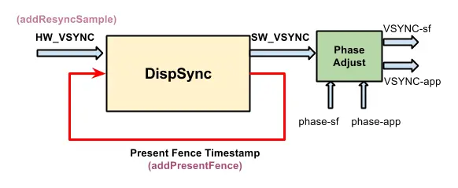

#垂直同步信号


Android中什么是VSYNC信号，为何要有这个信号，这个信号是怎么产生的等等

## VSYNC信号的产生
Android系统在三缓存的机制下，为了让CPU和GPU同步，防止帧丢失，增加了垂直同步信号，垂直同步信号分为app和sf端


从图上可以看出SW_VSYNC并不是直接由HW_VSYNC产生，而是有DispSync产生，同样的VSYNC-sf和app也是直接由SV_VSYNC产生。
那么为什么SurfaceFlinger要用SW vsync而不是直接用HW vsync呢？猜测可能是硬件产生的信号的性能有影响吧，HW vsync每隔固定时间由显示屏产生中断，然后传给driver, driver再回调给SurfaceFlinger,
这样层层回调，性能上会有一定的影响。

这个图上对应4个线程：
EventControlThread: 控制硬件vsync的开关
DispSyncThread: 软件产生vsync的线程
SF EventThread: 该线程用于SurfaceFlinger接收vsync信号用于渲染
App EventThread: 该线程用于接收vsync信号并且上报给App进程，App开始画图
从这4个线程，其实我们可以将vsync分为4种不同的类型

HW vsync, 真实由硬件产生的vsync信号
SW vsync, 由DispSync产生的vsync信号
SF vsync, SF接收到的vsync信号
App vsync, App接收到的vsync信号


由上可见VSYNC的产生还是比价复杂，涉及到多个线程异步运行，同时还是硬件信号到软件信号的转换，先从EventThread开始梳理。

## EventThread
EventThread分为app和SF，用来管理app端和SF端的vsync的产生和分发。
[android-5.1.0:frameworks/native/services/surfaceflinger/SurfaceFlinger.cpp]

```
void SurfaceFlinger::initScheduler(DisplayId primaryDisplayId) {
    if (mScheduler) {
        // In practice it's not allowed to hotplug in/out the primary display once it's been
        // connected during startup, but some tests do it, so just warn and return.
        ALOGW("Can't re-init scheduler");
        return;
    }
  sp<VSyncSource> vsyncSrc = new DispSyncSource(&mPrimaryDispSync,
            vsyncPhaseOffsetNs, true, "app");
    mEventThread = new EventThread(vsyncSrc);
    sp<VSyncSource> sfVsyncSrc = new DispSyncSource(&mPrimaryDispSync,
            sfVsyncPhaseOffsetNs, true, "sf");
    mSFEventThread = new EventThread(sfVsyncSrc);
    mEventQueue.setEventThread(mSFEventThread);

    mEventControlThread = new EventControlThread(this);
    mEventControlThread->run("EventControl", PRIORITY_URGENT_DISPLAY);
}
```

EventThread	相移
App	VSYNC_EVENT_PHASE_OFFSET_NS
SF	SF_VSYNC_EVENT_PHASE_OFFSET_NS
这两个值都是可以配置的，BoardConfig.mk

[frameworks/native/services/surfaceflinger/EventThread.cpp]
```
bool EventThread::threadLoop() {
    DisplayEventReceiver::Event event;
    Vector< sp<EventThread::Connection> > signalConnections;
    signalConnections = waitForEvent(&event);

    // dispatch events to listeners...
    const size_t count = signalConnections.size();
    for (size_t i=0 ; i<count ; i++) {
        const sp<Connection>& conn(signalConnections[i]);
        // now see if we still need to report this event
        status_t err = conn->postEvent(event);
        if (err == -EAGAIN || err == -EWOULDBLOCK) {
            // The destination doesn't accept events anymore, it's probably
            // full. For now, we just drop the events on the floor.
            // FIXME: Note that some events cannot be dropped and would have
            // to be re-sent later.
            // Right-now we don't have the ability to do this.
            ALOGW("EventThread: dropping event (%08x) for connection %p",
                    event.header.type, conn.get());
        } else if (err < 0) {
            // handle any other error on the pipe as fatal. the only
            // reasonable thing to do is to clean-up this connection.
            // The most common error we'll get here is -EPIPE.
            removeDisplayEventConnection(signalConnections[i]);
        }
    }
    return true;
}

Vector< sp<EventThread::Connection> > EventThread::waitForEvent(
        DisplayEventReceiver::Event* event)
{
    Mutex::Autolock _l(mLock);
    Vector< sp<EventThread::Connection> > signalConnections;

    do {
        bool eventPending = false;
        bool waitForVSync = false;

        size_t vsyncCount = 0;
        nsecs_t timestamp = 0;

        for (int32_t i=0 ; i<DisplayDevice::NUM_BUILTIN_DISPLAY_TYPES ; i++) {
            timestamp = mVSyncEvent[i].header.timestamp;
            if (timestamp) {
                //如果这时从 mVSyncEvent里取得的timestamp大于0，表明这时已经有vsync事件待发送
                //从这里可以看出 mVSyncEvent就是保存VSYNC信号的变量，待后面分析
                // we have a vsync event to dispatch
                *event = mVSyncEvent[i];
                mVSyncEvent[i].header.timestamp = 0; 
                vsyncCount = mVSyncEvent[i].vsync.count;
                break;
            }
        }

        if (!timestamp) { 
            // no vsync event, see if there are some other event
            //没有vsync事件， 来看下是否有其它pending的event, 这里主要是hotplug的事件
            eventPending = !mPendingEvents.isEmpty();
            if (eventPending) {
                // we have some other event to dispatch
                *event = mPendingEvents[0];
                mPendingEvents.removeAt(0);
            }
        }

        // find out connections waiting for events
        // mDisplayEventConnections保存的是注册的Connection的,
       //  SF EventThread线程里只有一个Connection, 而这个Connection主要是用来渲染
        // 而如果是APP EventThread, 这里会有多个connection
        size_t count = mDisplayEventConnections.size();
        for (size_t i=0 ; i<count ; i++) {
            sp<Connection> connection(mDisplayEventConnections[i].promote());
            if (connection != NULL) {
                bool added = false;
              //这里的connection->count的值的大小有如下含义
             // count >= 1 : continuous event. count is the vsync rate  如果在大于等于1，表示会持续接收vsync event
            // count == 0 : one-shot event that has not fired    表示只接收一次
            // count ==-1 : one-shot event that fired this round / disabled   等于-1，表示不能再接收vsync事件了

                if (connection->count >= 0) {  //只能对还能接收的connection进行处理
                    // we need vsync events because at least
                    // one connection is waiting for it
                    waitForVSync = true;  //这个变量后面会用到
                    if (timestamp) {
                        // we consume the event only if it's time
                        // (ie: we received a vsync event)
                        if (connection->count == 0) {  //如定义一样，如果是一次性的，那么在获得本次vsync后，将它的count置为-1了, 下次只能通过 requestNextVsync 来重置为0
                            // fired this time around
                            connection->count = -1;
                            signalConnections.add(connection);  //最外层的while判断条件会用到
                            added = true;
                        } else if (connection->count == 1 ||
                                (vsyncCount % connection->count) == 0) {
                            // continuous event, and time to report it
                            signalConnections.add(connection);
                            added = true;
                        }
                    }
                }
                
                if (eventPending && !timestamp && !added) {
                    // we don't have a vsync event to process
                  // 英文注释已经写的很明白了，如果此时没有vsync事件，但是有pending的事件，那不管connection是否能接收了
                    // (timestamp==0), but we have some pending
                    // messages.
                    signalConnections.add(connection);
                }
            } else {
                // we couldn't promote this reference, the connection has
                // died, so clean-up!
                mDisplayEventConnections.removeAt(i);
                --i; --count;
            }
        }

        // Here we figure out if we need to enable or disable vsyncs
        if (timestamp && !waitForVSync) {
            // we received a VSYNC but we have no clients
            // don't report it, and disable VSYNC events
          // 英文注释已经写的很明白了，vsync事件已经发生了，但是我都还没有client去监听，那么这时你再继续发vsync根本就是多余的
         // 所以直接disable Vsync, 注意这里并不是真正的disable硬件的VSYNC信号，见下面的分析
            disableVSyncLocked();
        } else if (!timestamp && waitForVSync) {
            // we have at least one client, so we want vsync enabled
            // (TODO: this function is called right after we finish
            // notifying clients of a vsync, so this call will be made
            // at the vsync rate, e.g. 60fps.  If we can accurately
            // track the current state we could avoid making this call
            // so often.)
        // 如果有client在监听了，但是还没有vsync事件，那么是否是之前vsync被disable了呢？
       //如果是的就要打开vsync监听，
            enableVSyncLocked();
        }

        // note: !timestamp implies signalConnections.isEmpty(), because we
        // don't populate signalConnections if there's no vsync pending
        if (!timestamp && !eventPending) {//既没有vsync事件，也没有其它pending的事件(hotplug事件)
            // wait for something to happen
            if (waitForVSync) {  //但是有client在监听了，这时就等着上报vsync事件即可
                // This is where we spend most of our time, waiting
                // for vsync events and new client registrations.
                //
                // If the screen is off, we can't use h/w vsync, so we
                // use a 16ms timeout instead.  It doesn't need to be
                // precise, we just need to keep feeding our clients.
                //
                // We don't want to stall if there's a driver bug, so we
                // use a (long) timeout when waiting for h/w vsync, and
                // generate fake events when necessary.
                bool softwareSync = mUseSoftwareVSync; //这里只考虑硬件vsync的情况,软件模拟的暂时不考虑
                nsecs_t timeout = softwareSync ? ms2ns(16) : ms2ns(1000);
              //如注释所说的，如果是driver的bug,如果硬件一直不上报vsync事件怎么办？？难道就一直等下去？？那client不就饿死了么？
             //所以这里如果driver不报vsync，那么就软件模拟一个vsync事件，这里的timeout是1000ms，发一个
   
                if (mCondition.waitRelative(mLock, timeout) == TIMED_OUT) {
                    if (!softwareSync) {
                        ALOGW("Timed out waiting for hw vsync; faking it");
                    }
                    // FIXME: how do we decide which display id the fake
                    // vsync came from ?
                    mVSyncEvent[0].header.type = DisplayEventReceiver::DISPLAY_EVENT_VSYNC;
                    mVSyncEvent[0].header.id = DisplayDevice::DISPLAY_PRIMARY;
                    mVSyncEvent[0].header.timestamp = systemTime(SYSTEM_TIME_MONOTONIC);
                    mVSyncEvent[0].vsync.count++;
                }
            } else {
                // Nobody is interested in vsync, so we just want to sleep.
                // h/w vsync should be disabled, so this will wait until we
                // get a new connection, or an existing connection becomes
                // interested in receiving vsync again.
              //既没有client, 又没有硬件vsync事件，那么就死等下去了。
                mCondition.wait(mLock);
            }          
            
        }
    } while (signalConnections.isEmpty());

    // here we're guaranteed to have a timestamp and some connections to signal
    // (The connections might have dropped out of mDisplayEventConnections
    // while we were asleep, but we'll still have strong references to them.)
    return signalConnections;
}
```